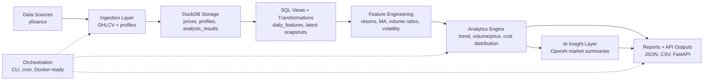
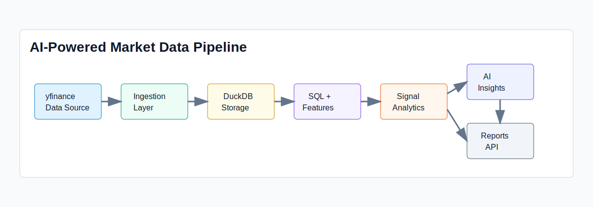
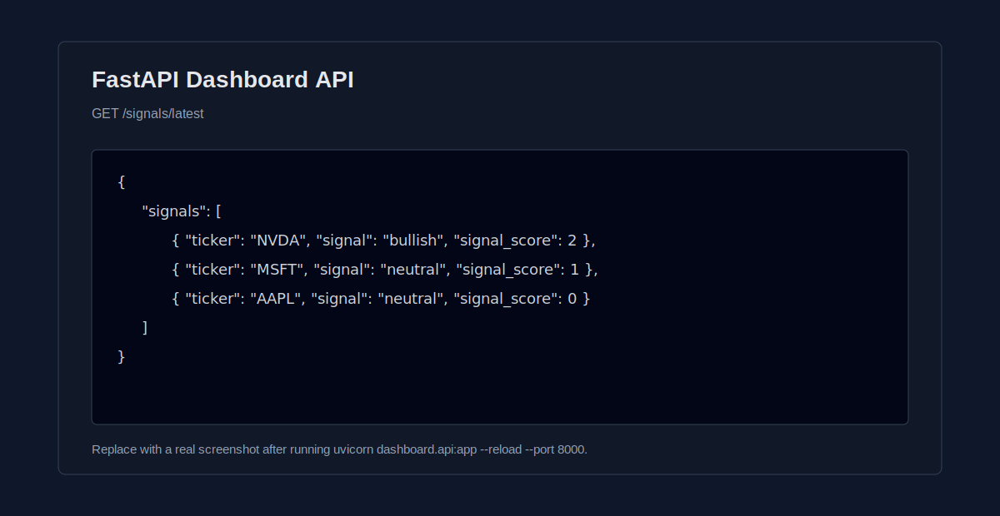
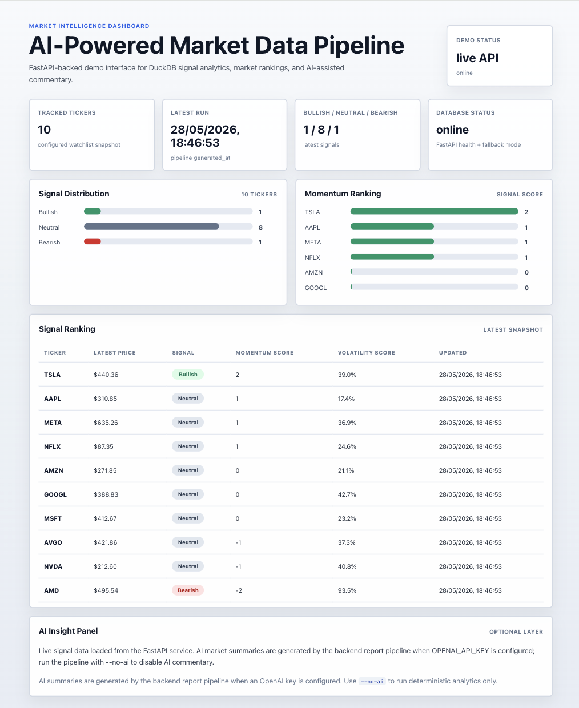
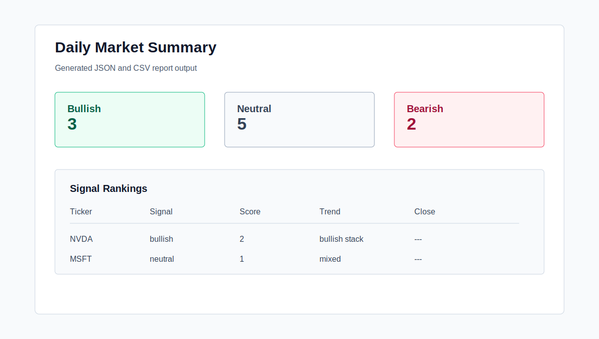
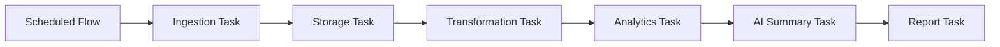

# AI-Powered Market Data Pipeline

A portfolio-grade data engineering and AI analytics project for US equity market intelligence. The pipeline ingests market data, stores it in DuckDB, builds analytical features, produces signal rankings, generates optional AI summaries, and exposes outputs through reports and a FastAPI dashboard API.

This project is designed to demonstrate how a modern analytics platform can be organized around ingestion, storage, transformation, deterministic analytics, AI interpretation, orchestration, and API-ready outputs.

## Architecture Overview





## What This Demonstrates

- Market data ingestion with configurable US equity tickers
- DuckDB-backed analytical storage
- Python feature engineering for time-series analytics
- SQL transformation views for warehouse-style workflows
- Signal analytics for trend, volume/price behavior, volatility, and cost distribution
- AI-generated market summaries using the OpenAI API
- Report generation in JSON and CSV formats
- FastAPI dashboard API for downstream applications
- Orchestration-ready pipeline entry point
- Docker-ready local deployment

## Tech Stack

| Layer | Technology | Purpose |
| --- | --- | --- |
| Language | Python | Pipeline, analytics, API, reporting |
| Data Source | yfinance | US equity OHLCV and profile data |
| Storage | DuckDB | Embedded analytical warehouse |
| Transformations | pandas, SQL | Feature engineering and analytical views |
| Analytics | NumPy, pandas | Signal scoring and market feature logic |
| AI Layer | OpenAI API | Natural-language market commentary |
| API | FastAPI, Uvicorn | Dashboard/API service |
| Orchestration | CLI, cron-compatible entry point, optional Prefect flow | Repeatable pipeline execution |
| Deployment | Docker, Docker Compose | Portable local runtime |

## Project Structure

```text
market-data-pipeline/
├── ingestion/              # yfinance ingestion and ticker normalization
├── storage/                # DuckDB schema, upserts, query helpers
├── transformations/        # Python features and SQL transformation views
├── analytics/              # Signal engine and ranking logic
├── ai_insights/            # OpenAI prompt and summary generation
├── reports/                # JSON/CSV report generation and samples
├── dashboard/              # FastAPI dashboard API and lightweight web UI
├── orchestration/          # End-to-end runner and optional Prefect flow
├── config/                 # Watchlist and runtime settings
├── sql/                    # Reusable DuckDB analytics examples
├── docs/                   # Architecture, demo, scheduling, assets
├── tests/                  # Core analytics tests
├── docker/                 # Container build files
└── scripts/                # CLI entry points
```

## Quick Start

```bash
cd market-data-pipeline
python3 -m venv .venv
source .venv/bin/activate
pip install -r requirements.txt
cp .env.example .env
```

AI summaries are optional. Add `OPENAI_API_KEY` to `.env` to enable the AI insight layer.

## Configure Tickers

Edit [config/watchlist.yaml](config/watchlist.yaml):

```yaml
market: US
default_period: 1y
tickers:
  - AAPL
  - MSFT
  - NVDA
  - TSLA
  - AMZN
```

The default watchlist includes `AAPL`, `MSFT`, `NVDA`, `TSLA`, `AMZN`, `META`, `GOOGL`, `AMD`, `NFLX`, and `AVGO`.

## Example CLI Usage

Run the pipeline without AI:

```bash
python scripts/run_pipeline.py --no-ai
```

Run the pipeline with AI summaries:

```bash
python scripts/run_pipeline.py
```

Expected output:

```json
{
  "date": "2026-05-28",
  "paths": {
    "json": "/project/reports/output/daily_market_summary_2026-05-28.json",
    "csv": "/project/reports/output/signal_rankings_2026-05-28.csv"
  }
}
```

## Demo Walkthrough

1. Install dependencies.

   ```bash
   python3 -m venv .venv
   source .venv/bin/activate
   pip install -r requirements.txt
   ```

2. Configure tickers.

   ```bash
   sed -n '1,80p' config/watchlist.yaml
   ```

3. Run the pipeline.

   ```bash
   python scripts/run_pipeline.py --no-ai
   ```

4. Inspect DuckDB data.

   ```bash
   duckdb data/market_pipeline.duckdb "select ticker, count(*) as rows from prices group by ticker order by ticker;"
   ```

5. Open the generated report.

   ```bash
   ls reports/output
   python -m json.tool reports/output/daily_market_summary_<date>.json | sed -n '1,80p'
   ```

6. Start the FastAPI dashboard API.

   ```bash
   uvicorn dashboard.api:app --reload --port 8000
   ```

7. Query an endpoint.

   ```bash
   curl http://localhost:8000/health
   curl http://localhost:8000/signals/latest
   curl http://localhost:8000/prices/AAPL
   ```

See [docs/demo_walkthrough.md](docs/demo_walkthrough.md) for a recording-ready demo script.

## Example API Usage

Start the API:

```bash
uvicorn dashboard.api:app --reload --port 8000
```

Run the pipeline from the API:

```bash
curl -X POST "http://localhost:8000/pipeline/run?no_ai=true"
```

Fetch latest signal rankings:

```bash
curl "http://localhost:8000/signals/latest"
```

Fetch historical prices for a ticker:

```bash
curl "http://localhost:8000/prices/AAPL"
```



## Lightweight Dashboard UI

The project includes a small React + Vite + TypeScript dashboard under [dashboard/web](dashboard/web). It consumes the existing FastAPI API when live data is available and falls back to documented sample data from `dashboard/web/src/sampleData.ts` for portfolio demos.



Start the backend:

```bash
python -m uvicorn dashboard.api:app --reload
```

Start the frontend:

```bash
cd dashboard/web
npm install
npm run dev
```

Configure the API base URL:

```bash
cp dashboard/web/.env.example dashboard/web/.env
```

The default frontend API target is `http://localhost:8000`. See [docs/dashboard.md](docs/dashboard.md) for screenshot instructions and demo notes.

## Example Output

A sample report is available at [reports/samples/daily_market_summary_sample.json](reports/samples/daily_market_summary_sample.json).

```json
{
  "date": "2026-05-28",
  "market": "US equities",
  "summary": {
    "tickers_analyzed": 10,
    "bullish": 3,
    "neutral": 5,
    "bearish": 2
  },
  "ai_summary": "Sample placeholder. Run scripts/run_pipeline.py to generate live output."
}
```



## DuckDB + SQL Analytics Examples

Reusable DuckDB queries live in [sql](sql). They are meant to demonstrate warehouse-style analytics on top of the persisted pipeline tables.

Run all examples:

```bash
python scripts/run_sql_examples.py
```

Use a custom database path:

```bash
python scripts/run_sql_examples.py --database data/market_pipeline.duckdb
```

The runner handles missing databases or missing report artifacts gracefully and prints hints for what to run next.

| Query | File | Demonstrates |
| --- | --- | --- |
| Latest signal ranking | [sql/latest_signal_ranking.sql](sql/latest_signal_ranking.sql) | Window functions over `analysis_results` to produce the latest ranked signal snapshot |
| Average volume by ticker | [sql/average_volume_by_ticker.sql](sql/average_volume_by_ticker.sql) | Aggregation over recent OHLCV history in `prices` |
| Strongest momentum tickers | [sql/strongest_momentum_tickers.sql](sql/strongest_momentum_tickers.sql) | 20-session return calculation with `lag` |
| Volatility summary | [sql/volatility_summary.sql](sql/volatility_summary.sql) | Risk ranking using persisted analytics outputs |
| Latest AI summaries | [sql/latest_ai_summaries.sql](sql/latest_ai_summaries.sql) | Querying generated JSON report artifacts with DuckDB |

See [docs/sample_sql_output.md](docs/sample_sql_output.md) for realistic runner output.

Latest signal ranking:

```sql
select ticker, date, signal, signal_score, trend_alignment, close, change_pct
from analysis_results
qualify row_number() over (partition by ticker order by date desc) = 1
order by signal_score desc, ticker;
```

Average recent volume by ticker:

```sql
select ticker, avg(volume) as avg_volume
from prices
where date >= current_date - interval 30 day
group by ticker
order by avg_volume desc;
```

Strongest momentum tickers:

```sql
with latest as (
    select
        ticker,
        date,
        close,
        close / first_value(close) over (
            partition by ticker
            order by date
            rows between 20 preceding and current row
        ) - 1 as return_20d
    from prices
)
select ticker, date, round(return_20d * 100, 2) as return_20d_pct
from latest
qualify row_number() over (partition by ticker order by date desc) = 1
order by return_20d_pct desc;
```

Latest generated report records are stored as JSON/CSV files under `reports/output/`. The current schema keeps AI summaries in report artifacts rather than a warehouse table, and DuckDB can query those JSON files directly.

## Data Engineering Concepts Demonstrated

- Config-driven ingestion and watchlists
- Idempotent upserts into analytical tables
- Historical OHLCV persistence
- Warehouse-style SQL views
- Python feature generation over time-series data
- Signal result persistence for API/dashboard consumption
- Separation of ingestion, storage, transformations, analytics, AI, and outputs
- Cron-compatible orchestration
- Containerized local runtime

## AI Analytics Layer

The AI layer receives compact, structured signal context from the deterministic analytics engine. It does not replace the analytics logic; it explains the outputs in natural language.

The generated summary focuses on:

- market regime snapshot
- constructive signals
- risk or caution signals
- trend and volatility commentary
- next-session watchlist

If `OPENAI_API_KEY` is not configured, the pipeline still runs and writes a skipped-summary message.

## Docker

```bash
docker compose up --build
```

The API starts at `http://localhost:8000` and mounts local `data/`, `reports/output/`, and `config/` directories.

## Optional Prefect Orchestration

Orchestration matters in data engineering because production pipelines need more than a script: they need named tasks, retries, scheduling, observability, and a clean path to backfills. The project keeps the existing CLI pipeline as the primary simple runner and adds Prefect as an optional orchestration demo.

Prefect is installed through `requirements.txt`, but it is only required if you want to run the orchestration demo.



Run the Prefect flow locally:

```bash
python scripts/run_prefect_flow.py --no-ai
```

The flow in [orchestration/prefect_flow.py](orchestration/prefect_flow.py) wraps the same pipeline concepts as the CLI:

- load config
- ingest market data
- persist to DuckDB
- run transformations
- generate signals
- optionally generate an AI summary
- write reports

In a production setting, the same structure could become a Prefect deployment, Airflow DAG, GitHub Actions scheduled workflow, or cloud scheduler job. See [docs/orchestration.md](docs/orchestration.md).

## Scheduling

Cron example:

```cron
30 18 * * 1-5 cd /path/to/market-data-pipeline && .venv/bin/python scripts/run_pipeline.py
```

The orchestration entry point in [orchestration/pipeline.py](orchestration/pipeline.py) can also be wrapped by Airflow, Prefect, Dagster, GitHub Actions, or another scheduler.

## Roadmap

- PostgreSQL storage adapter
- dbt project for curated feature marts
- Airflow or Prefect deployment example
- Dashboard UI for signal exploration
- Data quality checks and backfill commands
- Conversational querying over market history
- Vector search over generated AI market commentary
- Automated video/report rendering with FFmpeg and Puppeteer

## Disclaimer

This project is for research and analytics purposes only and does not constitute financial advice.
