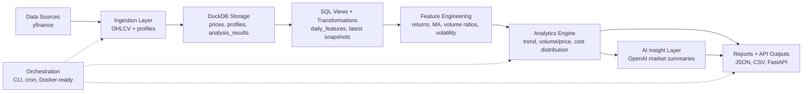
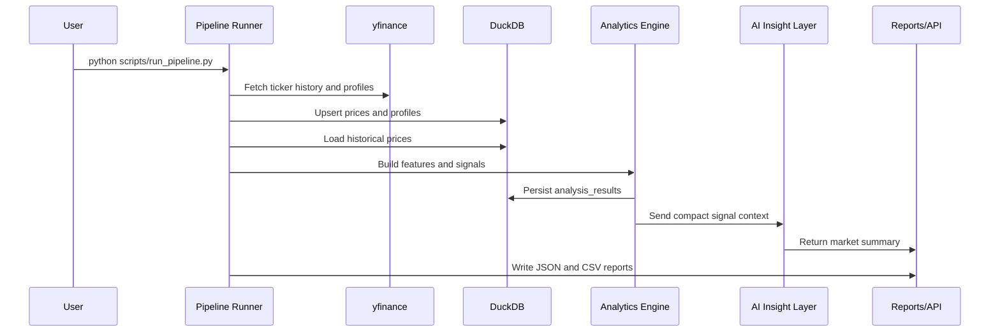

# Architecture

The platform follows a layered pipeline design:

## Component Responsibilities

- `ingestion/`: external market data access and ticker normalization.
- `storage/`: warehouse schema, table creation, upserts, and SQL query helpers.
- `transformations/`: Python and SQL feature engineering.
- `analytics/`: deterministic signal generation and ranking logic.
- `ai_insights/`: prompt construction and OpenAI summary generation.
- `reports/`: JSON/CSV output generation.
- `dashboard/`: FastAPI service layer.
- `orchestration/`: composable pipeline entry point for local, cron, CI, or Airflow/Prefect execution.

## Runtime Flow

