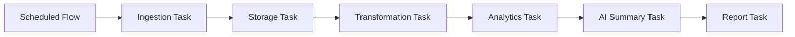

# Data Engineering Notes

## Warehouse Model

DuckDB is used as a local analytical warehouse. It gives the project real persistence and SQL analytics without requiring an external database for the first version. The database is configured through `config/settings.yaml` and defaults to `data/market_pipeline.duckdb`.

Tables:

- `prices`: append/upsert OHLCV time series by ticker and date.
- `instrument_profiles`: yfinance metadata for names, sector, industry, valuation, and share count.
- `analysis_results`: daily signal outputs ready for reporting and dashboards.

The storage layer is intentionally small but data-engineering oriented:

- Tables have stable names and primary keys.
- Price and analysis records are upserted by ticker/date.
- The database can be queried directly with DuckDB, Python, or BI/dashboard tools.
- Generated reports remain file-based artifacts, but DuckDB can query them with `read_json_auto`.

## Transformation Strategy

Feature engineering currently runs in Python for portability and testability. SQL views in `transformations/sql/` show the warehouse-oriented path and can evolve into a dbt project.

The project has two SQL layers:

- `transformations/sql/`: reusable view definitions that model curated warehouse concepts such as daily features and latest snapshots.
- `sql/`: analyst-facing DuckDB examples that query persisted tables and generated report artifacts.

This split mirrors a common analytics engineering workflow: model the data first, then publish reusable analytical queries for reporting, dashboards, and exploratory analysis.

## SQL Analytics Examples

Run:

```bash
python scripts/run_sql_examples.py
```

Available examples:

- `sql/latest_signal_ranking.sql`: latest ranked signal snapshot from `analysis_results`.
- `sql/average_volume_by_ticker.sql`: recent average volume by ticker from `prices`.
- `sql/strongest_momentum_tickers.sql`: 20-session momentum using window functions.
- `sql/volatility_summary.sql`: latest volatility and risk summary from persisted analytics.
- `sql/latest_ai_summaries.sql`: AI summary excerpts from generated report JSON files.

These queries demonstrate:

- window functions
- aggregation
- latest-record filtering
- time-series momentum calculations
- risk ranking
- querying semi-structured JSON artifacts from DuckDB

## Orchestration Strategy

`orchestration/pipeline.py` is intentionally dependency-light. It can run from:

- local CLI
- cron
- GitHub Actions
- Prefect
- Airflow
- Dagster

The optional Prefect flow in `orchestration/prefect_flow.py` adds named task boundaries for demo and portfolio purposes:



This demonstrates the orchestration layer without moving core business logic into the scheduler. The same ingestion, storage, transformation, analytics, AI, and reporting functions remain reusable from CLI, API, tests, and future production schedulers.

See `docs/orchestration.md` for the full orchestration note.

## Path Toward dbt

The current SQL examples could evolve into dbt models with minimal conceptual changes:

- `transformations/sql/daily_features.sql` could become an intermediate model such as `int_daily_features`.
- `transformations/sql/latest_signal_snapshot.sql` could become a mart model such as `mart_latest_signal_snapshot`.
- `sql/latest_signal_ranking.sql` and `sql/volatility_summary.sql` could become dashboard marts.
- `sql/average_volume_by_ticker.sql` and `sql/strongest_momentum_tickers.sql` could become reusable analytics models or exposures.
- Tests could be added for primary keys, accepted values, non-null dates, and freshness.

DuckDB is a practical local development target for dbt, while the same modeling pattern can later be moved to PostgreSQL, BigQuery, Snowflake, or another analytical backend.

## Production Hardening Roadmap

- Add idempotent backfills by date range.
- Add PostgreSQL adapter and environment switch.
- Add data quality checks for missing trading sessions and split-adjustment anomalies.
- Add retry policies around market data ingestion.
- Add dbt models for feature marts and signal snapshots.
